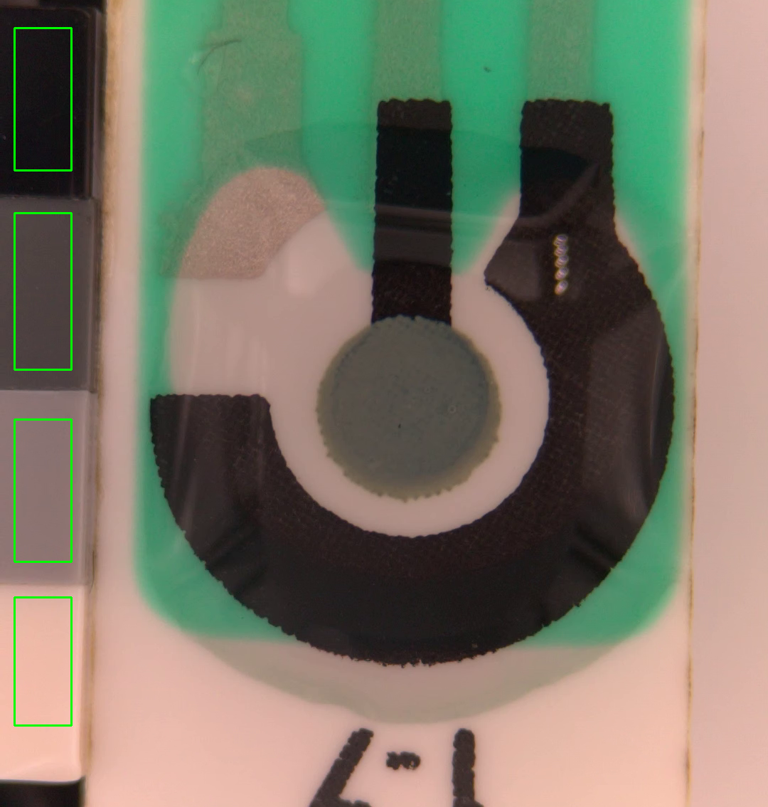

# BCmaterials_Electrocromismo

Repository for extraction of reflectance curves of a material reducing the effect of gamma correction using computer vision techniques.

## 🛠 Installation
To use the repository you must clone it:
```bash
git clone git@github.com:pgalantec/electrochromic_characterization.git
```

## Use
1. Run makefile create_env to create the virtual environment
    ```bash
    make create_env
    ```
2. Secondly, your own file must be uploaded into dataset directory
3. Once you have the video files, an experiment can be configured using params.yaml. Here attached you can observe an example.

    To select the patches of the color checker it is necessary to enter the box with the pixel coordinates according to the frame resolution. 
    The format will be:

    ```[[x1, y1], [x2,y2]]]```

    To know the pixels it is recommended to open a frame of the video in an external tool such as GIMP.

    An example of the patches is attached
    

    ```yaml
    videos:
      - video_path: "dataset/video.mp4"     # Video path
        exp_name: "Exp-OptGamma"            # Experiment name
        calibration: False                  # ¿Do you want to linearize Gamma? TRUE/FALSE
        frame_dtype: Y                      # Output color space: gray/Y/L
        patches: [                          # Color checker position with respect to video resolution
            [[20, 1200], [100, 1380]],          # Black 
            [[20, 950], [100, 1150]],           # Dark-grey
            [[20, 660], [100, 880]],            # Clear-grey
            [[20, 400], [100, 600]]             # White
        ]
    
    lego_srgb:
      black: [18, 18, 21]                   # Black 
      dark_grey: [98, 101, 102]             # Dark-grey
      clear_grey: [160, 163, 164]           # Clear-grey
      white: [244, 238, 228]                # White
    ```

    As it can be observed, there are two main parameters, "videos", that is a list with the configuration of your own experiments, and "lego_srgb" that are the nominal srgb values of the LEGO bricks included in the color checker.  

4. Once the experiments have been configured, scripts are launched to obtain the resulting analysis. 
    ```bash
    python -m src.experiment
    ```

5. Finally, results are stored in the experiment directory inside output folder.  

Additionally, "compare_curves.py" script has been provided, 

## Developers
- Pablo Galán (Tecnalia)
- Artzai Picón (Tecnalia)
- Jon Velasco (BCMaterials)

## License 
This project is under MIT license

